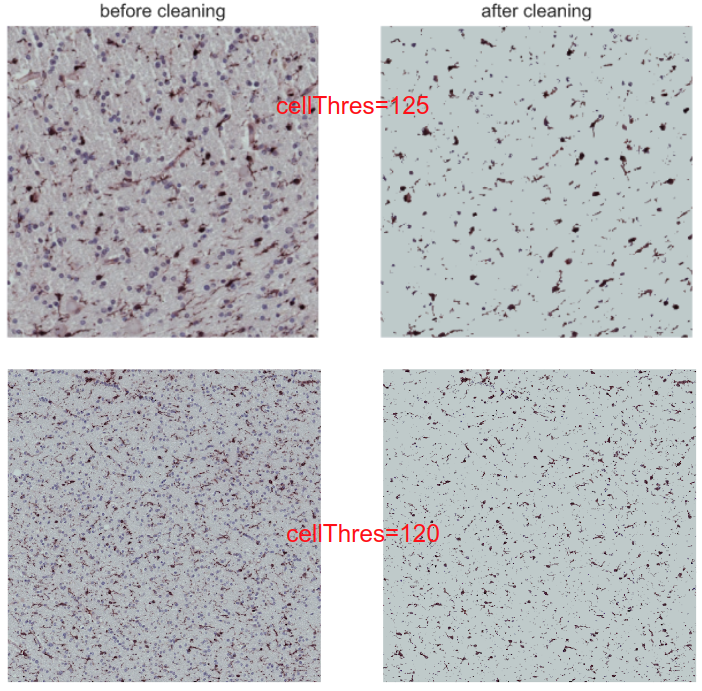
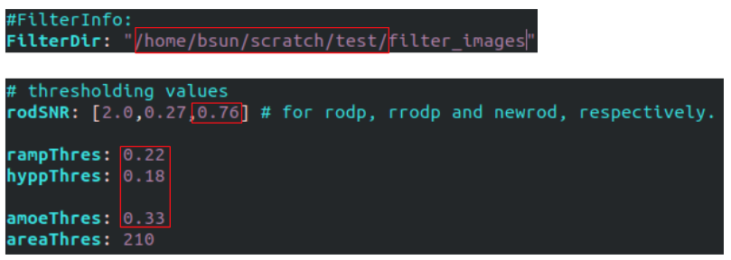

# Using the MACH filter to detect microglia morphology in humain brain tissue images.
The code is still in development. To run the code on our local cluster (faust.luc.edu), you need: 
1. Have a user account on Faust. 
2. Since this repo is written in python and uses heavily standard python libraries such as numpy/scipy/opencv, it is recommended to install the Anaconda python enviromnet on Faust.
   - Download [Anaconda](https://www.anaconda.com/products/individual#linux) onto Faust
   - In the terminal, type `bash Anaconda3-2020.07-Linux-x86_64.sh` to install.
   - After installation, tpye `which python` in the terminal, if you get the ouput `~/anaconda3/bin/python` which means the Anaconda is successfully installed.

3. The all 227 big images are in /data/bsun/MACH/images on Faust. These images are accessible to all Faust users.
5. To run the detection:
   - Download this reop (.zip) onto Faust and unzip it (`unzip microglia_MACH-master.zip`)
   - View the `prepare.sh` file, following the directions in the `prepare.sh` file.
   - Suppose you want to do analysis for image 10, after setting `ID=10` in the prepare.sh, executing it (`./prepare.sh`)
   - Go to sub-directory 10, view the `image10.yaml` and `Params.yaml`, **Change Some Parameters in these two yaml files**
     - In image10.yaml, change `ImagePath` to `/data/bsun/MACH/images/` (where the images are)
     - Change the `cellThres` value to something between `115-140`. This value is used to clean the background, and currently set as 125. We need to find the best value for each specific image.
     - The effect of `cellThres`:
       -
     - In `Params.yaml`, change the boxed parameters, the `FilterDir` should be where you unziped the repo zip, and for thresholding values part, try slightly increase/decrase the values from the default vavlues.
       -
    - tybe `sbatch run.sh` in the terminal to submit the job (it will take about 4-7 hours depending on the size of the image)

6.  Analyze the results:
    - run `python analyze.py 10` in the directory where you unziped the repo zip. This will analyze the results and generate some image/txt outputs and binary images representing the detection of each cell type (`rodbinary`,`rambinary`, etc)
    - These binary images are actually 2D numpy arrays and can be loaded with the `binaryImageAnalysis.ipynb` in the repo further anlysis.
